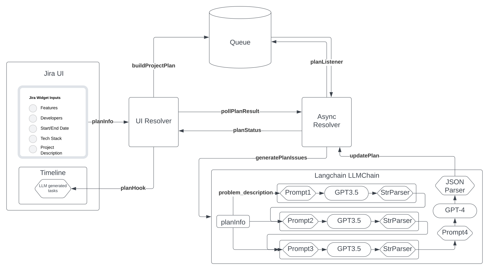

# Atlassian-Forge

## Architecture

## Installation Instructions For Windows

### From Atlassian Distribution
1. Install from Link [Install Directly](https://developer.atlassian.com/console/install/8aa768aa-1796-44a5-8072-12a2b568d846?signature=780749fb21037b7880f34b775f92c7e0d3c406970756f477baeae58715efde203c57fbee7e8ad54d8339637d74cffe112995f003a028911d882870ca0c51236a&product=jira)!

### From GitHub
1. Follow Windows 10 instructions to install Node.JS [Install Forge On Windows](https://developer.atlassian.com/platform/forge/installing-forge-on-windows/)!
2. Install the Forge CLI and create an Atlassian API Key [Install Forge CLI](https://developer.atlassian.com/platform/forge/getting-started/#install-the-forge-cli)!
3. Clone GitHub Repository
4. From smart-plan dir, run `npm install`
5. Ensure OPEN_AI_API Env key is set using `forge varibles set OPENAI_API_KEY <your-api-key>`
6. Run `forge deploy`
7. Run `forge install` and follow the according instructions.

## Inspiration

After completing our last hackathon, our team was interested in seeing how much an LLM could really plan, given a problem, start and end dates, team members and their respective skills, and a breakdown of the tech stack.

We wanted to see if we could automate bootstrapping a software project plan.

## What it does

Takes a user's input for: 

1. problem description
2. start date
3. end date
4. team
5. features
6. technical stack

and populates a Jira timeline with issues that lead to the completion of the problem.

## How we built it

We built it using the forge cli, forge's new nodejs runtime preview, jira REST api, langchain, and openai api over the course of 48 hours. 

## Challenges we ran into
A major blocker to development for us was trying to debug the backend handler in forge. Not being able to console log or see any output during our testing unless we returned it back to the frontend was a major slowdown. 

Another issue we ran into was the 25s timeout imposed on the frontend async calls. This was a severe roadblock because our LLM chain took ~30s to run. This issue required us to completely rework the system using Async events, which we are happy we got to explore. It was very interesting implementing our own .yml configuration and seeing the backend listener actually pick up jobs as we queued them from the frontend.

## Accomplishments that we're proud of

We are very proud of our implementation of the Async Events. It works extremely well and we learned plenty implementing it.

We are also proud of the LLM chain we crafted. We think the unique combination we made by feeding in the user's inputs sequentially though the chain improved the creativity and reliability of the program. 

## What we learned

- basics of forge cli, and deploying with forge
- jira api, and how to create issues via REST.
- GPT4 is essential for good JSON parsing
- to run langchain on forge, you need to use the node runtime (preview)
- langchain prompts/chains/parsers

## What's next for Intelli-Planner

- polish up the frontend
- make it easier for anyone to use their own API keys for any model
- continue improving reliability of JSON output
- continue iterating upon prompts
- add a slider to enable users to increase/decrease the temperature (randomness/creativity) of the LLMs.

